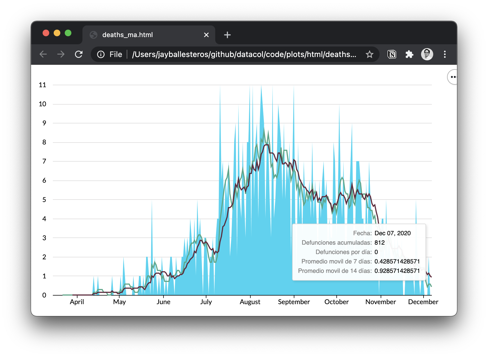

---
title: Portfolio
layout: template
filename: portfolio
order: 2
---  

-------------

Here are a few examples of projects and publications I’ve worked on that might be relevant. Some consulting work can’t be shared due to NDAs, but I’m happy to talk through it if helpful.

## Open publications

#### [Atopic Dermatitis: Beyond the Skin. Impact on quality of life in México](https://fundacionidea.org.mx/publication_detail/84){:target="_blank"}
_May 2024 | Fundación IDEA_

During my time as a Senior Analyst at Fundación IDEA, I co-authored this report on atopic dermatitis in Mexico. The publication examines the multifaceted impact of the disease on patients’ quality of life, including physical discomfort, psychological effects, and social implications. It also highlights the disease’s economic burden, covering both direct medical costs and indirect costs.

My responsibilities included designing the methodology and survey instruments, conducting interviews and data collection, and performing descriptive statistical analysis and data visualization (exclusively in Python). I also contributed to drafting and editing the report.

To view an English executive summary, click [here](https://fundacionidea.org.mx/storage/IDEA/files/mxSAN005_DA_two%20pager%20ENG_%20250509.pdf).

{: style="max-width: 100%; height: auto; margin: 0.5rem 0 1rem;"}

## Personal projects

#### [DataCol](https://github.com/jballesterosc/datacol_backup/tree/main/_backup){:target="_blank"}
_2020 | Python_

A personal project to scrape and analyze data from COVID-19 reports in Colima, Mexico. The work involved data cleaning, visualization, and descriptive statistics to better understand the spread and impact of the virus across the state.

A key milestone was receiving an award from the state government to support the development of a web application that visualized the data and provided real-time updates to the public. The final outcome was the full handover of the application to the Ministry of Health of Colima.

Another takeaway is that I built this platform in the pre-ChatGPT era, so most of the code was written from scratch. This significantly strengthened my Python skills and my understanding of data analysis workflows.

{: style="max-width: 100%; height: auto; margin: 0.5rem 0 1rem;"}

## Recent technical assignments

#### [Statistical Inference Toolkit in R: Hypothesis Tests, Regression & Simulation](documents/Statistics_R.pdf){:target="_blank"}
_December 2025 | R _

Completed a technical assignment applying statistical tools like hypothesis testing, regression interpretation (including interactions / diff-in-diff logic), and Monte Carlo simulation to illustrate power and sample-size effects, documenting both the write-up and reproducible R workflow.

#### [Plastic Packaging Tax — Microeconomic Policy Evaluation (Illinois)](documents/Analysis_Micro_PPT.pdf){:target="_blank"}
_November 2025 | R | In collaboration with Coelho N. and Li, M._

Built a technical report evaluating a proposed plastic packaging tax using a welfare framework—deriving the Pigouvian benchmark, modeling market equilibrium, and assessing efficiency and incidence.

#### [Replication of CBO Distributional Analysis: “Big Beautiful Bill”](documents/Statistics_BBB.pdf){:target="_blank"}
_October 2025 | R_

Recreated key distributional charts from a Congressional Budget Office memo on the “Big Beautiful Bill” by building a reproducible R workflow—cleaning CPS-based microdata, constructing the CBO income concept (income + transfers − taxes), computing deciles, and aggregating policy-induced changes in household resources to match the memo’s figure logic.

{: style="max-width: 100%; height: auto; margin: 0.5rem 0 1rem;"}
